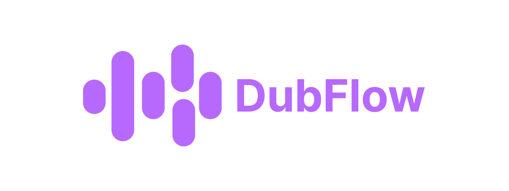

# DubFlow

DubFlow é um Produto para comunidades e organizações publicarem dublagens, organizarem portfólios e colaborarem em lançamentos.

## Visão do Produto

- comunidades com identidade própria
- playlists por obra, temporada e episódio
- publicações avulsas de áudio e vídeo
- créditos por personagem e dublador
- colaboração com fluxo de aceite antes da publicação
- interações sociais (seguidores, curtidas e comentários)

## Foco atual

- escalabilidade da aplicação
- navegação mais rápida e fluida
- experiência consistente em desktop e mobile

## Links principais

- Repositório oficial: [vitorgabrieldev/dubflow.pro.br](https://github.com/vitorgabrieldev/dubflow.pro.br)
- Documentação técnica: [`docs/README.md`](docs/README.md)
- Backlog de evolução: [`docs/AJUSTES.md`](docs/AJUSTES.md)
- Roadmap funcional: [`docs/DUBBING_ROADMAP.md`](docs/DUBBING_ROADMAP.md)
